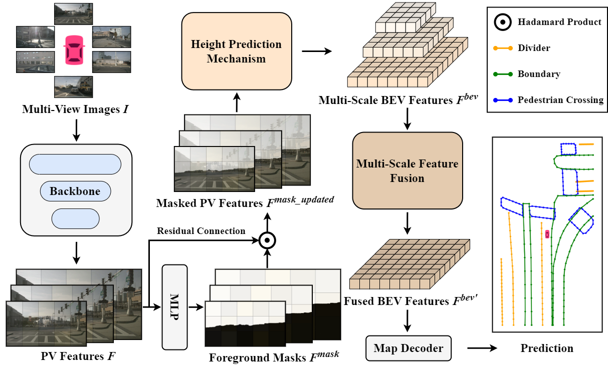

<div align="center">
  <h1>HeightMapNet</h1>
  
  <h3>Explicit Height Modeling for End-to-End HD Map Learning </h3>
  
  [](https://arxiv.org/abs/2411.01408)
  
  
</div>

## Introduction
This repository is an official implementation of HeightMapNet.

## Getting Started
### 1. Environment
**Step 1.** Create conda environment and activate it.

```
conda create --name heightmapnet python=3.8 -y
conda activate heightmapnet
```

**Step 2.** Install PyTorch.

```
pip install torch==1.9.0+cu111 torchvision==0.10.0+cu111 torchaudio==0.9.0 -f https://download.pytorch.org/whl/torch_stable.html
```

**Step 3.** Install MMCV series.

```
# Install mmcv-series
pip install mmcv-full==1.6.0
pip install mmdet==2.28.2
pip install mmsegmentation==0.30.0
git clone https://github.com/open-mmlab/mmdetection3d.git
cd mmdetection3d
git checkout v1.0.0rc6 
pip install -e .
```

**Step 4.** Install other requirements.

```
pip install -r requirements.txt
```

### 2. Data Preparation
**Step 1.** Download [NuScenes](https://www.nuscenes.org/download) dataset to `./datasets/nuScenes`.

**Step 2.** Generate annotation files for NuScenes dataset.

```
python tools/nuscenes_converter.py --data-root ./datasets/nuScenes --newsplit
```

### 3. Training and Validating
To train a model with 1 GPUs:

```
bash tools/dist_train.sh ${CONFIG} 1
```

To validate a model with 1 GPUs:

```
bash tools/dist_test_map.sh ${CONFIG} ${CEHCKPOINT} 1
```


## Results


### Results on NuScenes newsplit
| Method | $\mathrm{AP}_{divider}$ | $\mathrm{AP}_{boundary}$| $\mathrm{AP}_{ped-crossing}$ | $\mathrm{AP}$ | Config |  Checkpoint |
| :---: |   :---:  |  :---:  | :---:      |:---:|:---: |:---:   | :---:      |
| HeightMapNet | 62.8 | 60.4 | 54.3 | 59.1 | [Config](./projects/configs/heightmapnet.py) | [ckpt](https://1drv.ms/u/c/692c490b253a5349/EXv-25477lNFtpPMd06oOE4BLaljyJxPMjnnQOp8ANU2lg?e=aABvna)|

## Citation
If you find our paper or codebase useful in your research, please cite our paper.
```
@misc{qiu2024heightmapnetexplicitheightmodeling,
      title={HeightMapNet: Explicit Height Modeling for End-to-End HD Map Learning}, 
      author={Wenzhao Qiu and Shanmin Pang and Hao zhang and Jianwu Fang and Jianru Xue},
      year={2024},
      eprint={2411.01408},
      archivePrefix={arXiv},
      primaryClass={cs.CV},
      url={https://arxiv.org/abs/2411.01408}, 
}
```